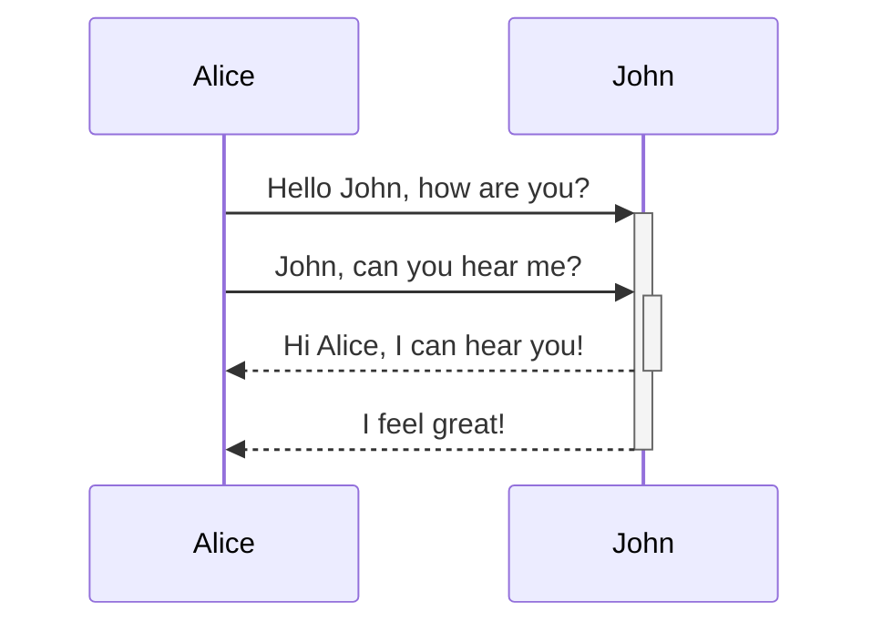
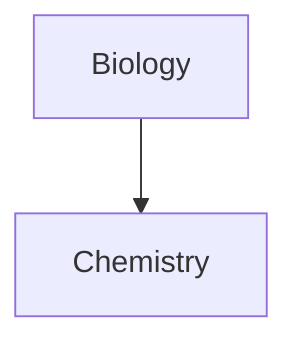

> *Данная записка будет пополняться по мере того, как я буду забывать какие то фишки форматтинга, тем самым вспомниая их и заполняя их тут.

[basic formatting syntax](https://help.obsidian.md/Editing+and+formatting/Basic+formatting+syntax)

### Математика
Математика для latex suite: https://oeis.org/wiki/List_of_LaTeX_mathematical_symbols

# Примеры
- - - 

>[!NOTE] Название
>как писать вот такие краисвые коллауты: [тут](https://help.obsidian.md/Editing+and+formatting/Callouts)

делаю якорь вот так[^1]

| Syntax          | Description                                               |
| --------------- | --------------------------------------------------------- |
| `[[Link]]`      | [Internal links](https://help.obsidian.md/links)          |
| `![[Link]]`     | [Embed files](https://help.obsidian.md/embeds)            |
| `![[Link#^id]]` | Block references                                          |
| `^id`           | Defining a block                                          |
| `[^id]`         | [Footnotes](https://help.obsidian.md/syntax#Footnotes)    |
| `%%Text%%`      | [Comments](https://help.obsidian.md/syntax#Comments)      |
| `~~Text~~`      | Strikethroughs                                            |
| `==Text==`      | Highlights                                                |
| ` ``` `         | Code blocks                                               |
| `- [ ]`         | Incomplete task                                           |
| `- [x]`         | Completed task                                            |
| `> [!note]`     | [Callouts](https://help.obsidian.md/callouts)             |
| (see link)      | [Tables](https://help.obsidian.md/advanced-syntax#Tables) |


```query
текст_для_поиска
```
про фишки с поиском [тут](https://help.obsidian.md/Plugins/Search)
поиск по слову (чтоб не надо теги было сувать повсюду) — Ctrl+F


##### tables && diagrams
```
Left-aligned text | Center-aligned text | Right-aligned text
:-- | :--: | --:
Content | Content | Content
```

| Left-aligned text | Center-aligned text | Right-aligned text |
| :---------------- | :-----------------: | -----------------: |
| Content           |       Content       |            Content |






[^1]: А вот и якорь, о котором шла речь.

# 1
## 2
### 3
#### 4
##### 5
###### 6
