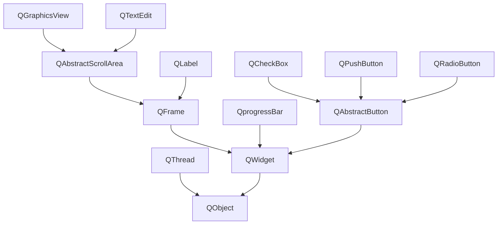

#prog 

```mermaid
graph TD
A[QWidget]
B[QAbstractButton]
    QThread  --> QObject
    A --> QObject
    QFrame --> A
    QprogressBar --> A
    B --> A
    QCheckBox --> B
    QPushButton --> B
    QRadioButton --> B
    QAbstractScrollArea --> QFrame
    QLabel --> QFrame
    QGraphicsView --> QAbstractScrollArea
    QTextEdit --> QAbstractScrollArea
```

