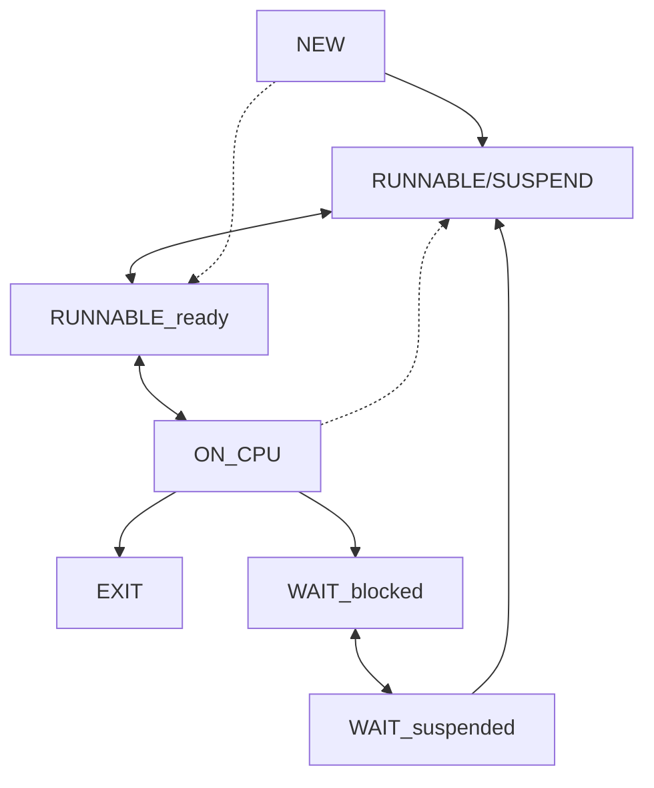

#uni 
#prog
# Процесс
Процесс — выполняемая программа; Экземпляр программы, выполняющейся на компьютере, сущностЬ, которая может быть назначена процессору и выполнена на нем, etc.

- идентификатор
- состояние
- приоритет
- программный счетчик
- указатели памяти
- данные контекста
- информация о состоянии ввода-вывода
- учетная информация
всё вышеперечисленное хранится в PCB

Раздереление ресурсов такого, что у нас етсь очередь процессов и процессам отведелно равное время на исполнение, как оно истекает, происходит переход к следующему процессу (в состоянии готовности), который исполнялся наименьшее время. Хотим таким образом достичь “честного” распределения ресурсов и не допустить голодания.

### 5 состояний
Новый → готовый к выполнению → выполняющийся → (блокированный*) → завершающийся

1. Новый — только что созданный процесс, который еще не помещен операционной системой в пул выполнимых процессов. Обычно это новый процесс, который еще не загружен в основную память, хотя управляющий блок процесса (PCB) уже создан.
2. Готовый к выполнению — Процесс, который может быть запущен, как только для этого предоставится возможность.
3. Выполняющийся — процесс, который выполняется в текущий момент времени.
4. Блокированный/Ожидающий — Процесс, который не может выполниться до тех пор, пока не произойдет некоторое событие, например завершение операции ввода-вывода.
5. Завершающийся --- Процесс, удаленный операционной системой из пула выполнимых процессов из-за завершения его работы или аварийно прерванный по какой-либо причине.
# Paging, swapping
Swapping (исторически первый) — выгрузка процесса на диск при неиспользовании целиком, а не отдельными структурами (что раньше было релаьно, т.к. процессы были маленькими, но сейчас надо много времени на выгрузку и загрузку обратно)

Paging — выгрузка не всего процесса, а отдельных неиспользуемых страниц. То есть, если в течение заданного времени страница не используется, то считается неиспользуемой и помечается, а потом система в зависимости от содержания принимает решение: если код, то удаляет (всегда можно из файла загрузить заново, он в принципе неизменяемый), если данное, то сохраняет в своп. Структуры ядра не выгружаются, потому что являются критически важными.

В Windows для этого используется файл pagefile.sys, а в Linux создаётся раздел swap.

### 7 состояний
NEW → RUNNABLE/SUSPEND → RUNNABLE(ready) → ON CPU → WAIT(blocked) → WAIT(suspended) 

→ EXIT из ON CPU

1. Runnable/Suspend - процесс может выполниться, но весь или частично находится в свопе. Сюда можно попасть либо из New (операционная система хочет положиться на тот же алгоритм activate для вытаскивания нужных процессу страниц в память. Только в редких случаях процесс может быть быстро загружен в память, тогда он перескочит сразу в Runnable/Ready).
2. Wait/Suspend - в это состояние процесс переходит, когда ОС решает, что он слишком долго блокируется, или когда памяти мало. Система приостанавливает и выгружает его в своп. После прихода ожидаемого события ОС отправляет его в Runnable/Suspend.

### Диаграмма состяоний для svr4
Всё начинается с системного вызова fork и в зависимости от наличия памяти попадает в состояние Ready в своп или в память.
Два состояния исполнения: user running и kernel running, связаны прерываниями (syscall, interrupt) и их возвратом (return).
В ядре процессы тоже прерываются, при этом у них могут меняться контексты.
Во время диспетчеризации программу могут выкинуть в runnable или вытеснить preempt а на её место записать другой процесс.
Когда до процесса доходит очередь, он возвращается из состояния ожидания в рабочий режим.
При системном вызове exit процесс попадает в состояние zombie (когда он уже невалиден, но структуры еще живы), после чего “умирает”.

PCB в Solaris состоит из структур proc_t и user_t и занимает порядка 2 КБ памяти.
P_as – указатель на адресацию памяти; содержит структуры, которые относятся к АП и его конкретным сегментам, а также определяют, именнованное оно (сегмент данных в файле) или анонимное (куча, стек).
Также он содержит треды на уровне ядра и пользователя.